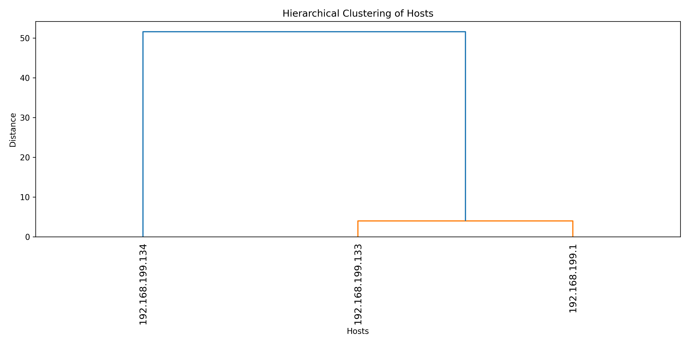

# 🕵️ NS-FinalProject-404: P2P Botnet Detection  

This project implements the method proposed by **Jiang & Shao (2012)** for detecting **P2P botnets** by analyzing **flow dependencies** in network traffic.  
The pipeline extracts flows from PCAP files, computes two-level and multi-level dependencies, and finally clusters suspicious hosts using **hierarchical clustering**.  

---

## 📂 Project Structure  

```
NS-FinalProject-404/
│
├── code/
│   ├── 1-Flow_Capture/              # Extract flows from PCAP
│   ├── 2-Flow_Dependency_Extractor/ # Build two-level and multi-level dependencies
│   ├── 3-Bots_Detector/             # Clustering to detect suspicious hosts
│   └── script.py                    # Runs the entire pipeline step by step
│
├── pcap/                            # Example PCAP dataset(s)
├── results/                         # Generated CSV and figures (only in results branch)
├── Docs/                            # Project paper and documentation
└── README.md
```

---

## 🌱 Branches  

- **master** → Contains only the **source code** (no results).  
  - Recommended if you just want the codebase (lighter version).  

- **results** → Contains both the **source code and the generated outputs** (CSV files, clustering plots).  
  - Recommended if you want to see ready-made results.  

👉 Clone the repository with results:  
```bash
git clone -b results https://github.com/<your-username>/NS-FinalProject-404.git
```

👉 Clone only the codebase (lighter):  
```bash
git clone -b master https://github.com/<your-username>/NS-FinalProject-404.git
```

---

## 🚀 Usage  

1. Place your `.pcap` file into the `pcap/` directory.  
   (An example file `EX-3.pcap` is already provided.)  

2. Run the pipeline using:  
```bash
python script.py
```

3. The script will automatically run the following steps:  
   - **Step 1:** Flow extraction from PCAP  
   - **Step 2:** Flow occurrences counting  
   - **Step 3:** Two-level dependency calculation  
   - **Step 4:** Multi-level dependency calculation  
   - **Step 5:** Bot detection via hierarchical clustering  

4. Outputs (CSV + figures) will be saved inside the `results/` directory.  

---

## 📊 Example Output  

Example dendrogram from clustering:  

  

Sample generated results include:  
- `flows.csv`, `flows_filtered.csv`  
- `flow_occurrences.csv`  
- `twolevel_dependencies.csv`  
- `multilevel_dependencies.csv`  
- `clusters.csv`  

A snippet from `clusters.csv`:  

| host             | cluster |
|------------------|---------|
| 192.168.199.133  | 1       |
| 192.168.199.134  | 1       |
| 192.168.199.1    | 2       |

---

## 📘 Documentation  

- The **paper** and project description are included in the `Docs/` folder.  
- The project relies on **Scapy** for PCAP parsing, **Pandas** for data processing, and **SciPy** for clustering.  
- Goal: detect **P2P botnets** by discovering flow dependencies in C&C traffic.  

---

## ⚡ Requirements  

- Python ≥ 3.9  
- Required libraries:  
```bash
pip install scapy pandas matplotlib scipy
```

---

## 🧾 Citation  

If you use this project, please cite:  
- Jiang, H., & Shao, Z. (2012). *Detecting P2P botnets by discovering flow dependency in C&C traffic.*  
